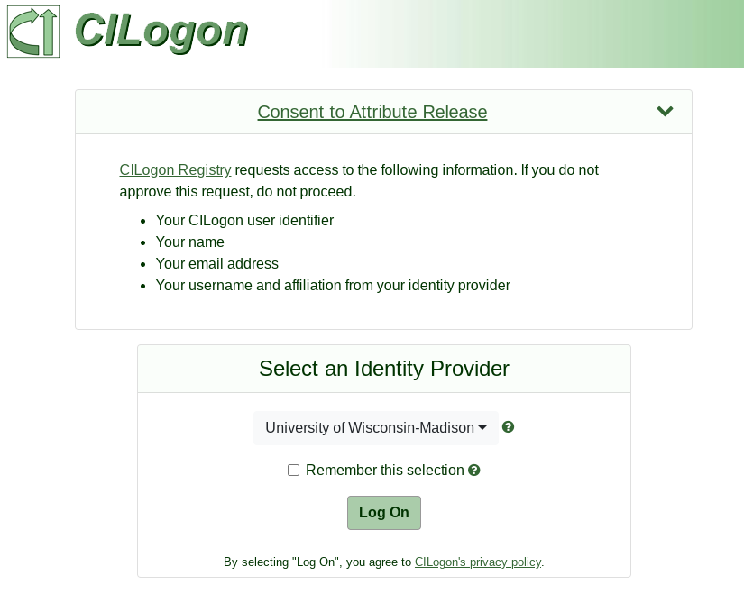
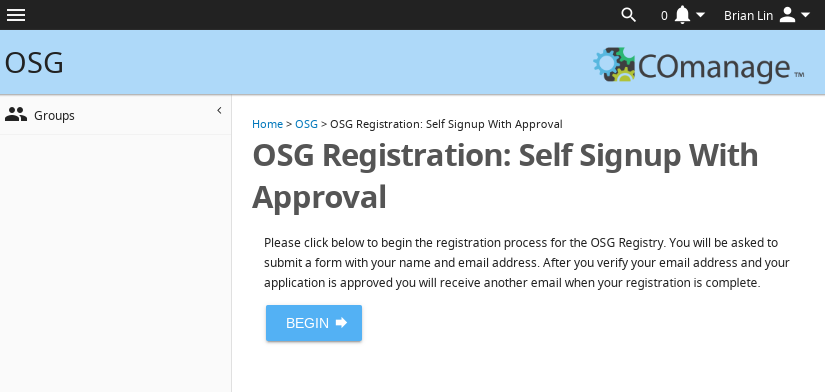
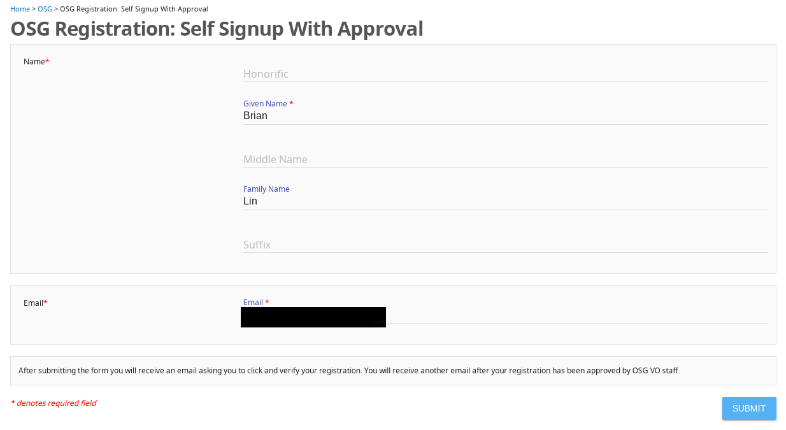

DateReviewed: 2020-08-12

Registering with the OSG
========================

!!! note "COManage administrators"
    This page is for users who want to register with the OSG.
    If you are a COManage Admin and need to approve a user registration,
    go to the [Approving COManage Registrations](../policy/comanage-instructions-admin) page instead.

OSG uses the [COManage](https://www.internet2.edu/products-services/trust-identity/comanage/) identity management system
to register OSG contacts.
COManage is backed by the [InCommon federation](https://www.incommon.org/federation/), meaning that users can register
with the OSG using their institutional identities with familiar single sign-on forms.

Submitting an Application
-------------------------

To register with the OSG, submit an appplication using the self-signup process:

1.  Go to <https://opensciencegrid.org/register>

1.  You will be presented with a CILogon Single-Sign On page.
    Select your insitution and sign in with your insitutional credentials:

    

1.  After you have signed in, you will be presented with the self-signup form.
    Click the "BEGIN" button:

    

1.  Enter your name and email address.
    In most cases, your institution will provide defaults for your name and email address.
    If you prefer, you may override these values.
    Click the "SUBMIT" button:

    

Verifying Your Email Address
----------------------------

After submitting your registration application, you will receive an email from <registry@cilogon.org> to verify your email
address.
Follow the link in the email and click the "Accept" button to complete the verification:

Waiting for Approval
--------------------

After verifying your email address, your registration must be approved by OSG staff.
Once your registration has been approved, you will receive an email confirming your OSG registration:

Getting Help
------------

For assistance with the OSG contact registration process, please use
[this page](https://opensciencegrid.org/docs/common/help/).
