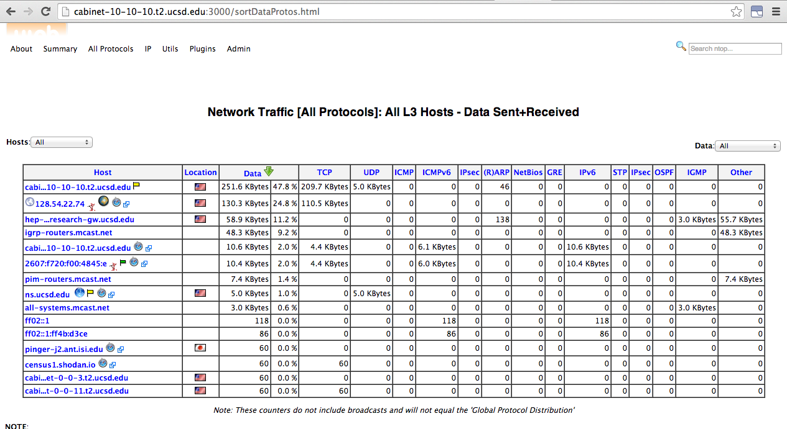

Testing Software with IPv6
==========================

About this Document
-------------------

This document provides instructions on setting up a host with an IPv6 address for testing the OSG software stack. The plan is to be able to spin up special Fermicloud VM’s that have corresponding public IPv6 addresses meaning that there will be a limit of ~15 VM’s at one time.

For more information on IPv6, consult [Wikipedia](http://en.wikipedia.org/wiki/IPv6).

### Requirements

1. Be familiar with your institute's network policy and firewall configuration 1 *Root* access is required to configure `iptables`

### Enabling IPV6

1. Determine the public IPv6 address of your host. In the example below that would be `2001:400:2410:29::182`:

        :::console hl_lines="1 6"
        user@host $ nslookup -type=aaaa <HOSTNAME>
        Server:     132.239.0.252      
        Address:    132.239.0.252#53      
        
        Non-authoritative answer:
        ipv6vm001.fnal.gov  has AAAA address 2001:400:2410:29::182

    Replacing `<HOSTNAME>` with your machine's hostname.

1. Ask your network administrator for your IPv6 default gateway
1. Modify `/etc/sysconfig/network-scripts/ifcfg-eth0` and be sure these lines exist, and : 

        :::console hl_lines="3"
        IPV6INIT=yes
        IPV6_AUTOCONF=no
        IPV6ADDR=<IPV6 ADDRESS>"
        IPV6_DEFAULTGW="The IPV6 Default Gateway"

    Replace `<IPV6 ADDRESS>` with the address found in step 1.

1. Restart the network devices:

        :::console
        root@host # service network restart
        Shutting down interface eth0:                              [  OK  ]
        Shutting down loopback interface:                          [  OK  ]
        Bringing up loopback interface:                            [  OK  ]
        Bringing up interface eth0:                                [  OK  ]

### Testing IPv6 connectivity

To verify that the VM is capable of IPv6 we will be using the `ping6` command between the test VM and another IPv6 capable machine

1. From another IPv6 capable machine, ping your VM:

        :::console
        user@host $ ping6 ipv6vm001.fnal.gov
        PING ipv6vm001.fnal.gov(ipv6vm001.fnal.gov) 56 data bytes
        64 bytes from ipv6vm001.fnal.gov: icmp_seq=1 ttl=51 time=68.1 ms
        64 bytes from ipv6vm001.fnal.gov: icmp_seq=2 ttl=51 time=57.6 ms

1. From your test VM, ping another IPv6 capable machine (a list of IPv6 machines can be found [here](#Ipv6Vms)):

        :::console
        [efajardo@ipv6vm001 ~]# ping6 uaf-4.t2.ucsd.edu
        PING uaf-4.t2.ucsd.edu(uaf-4.t2.ucsd.edu) 56 data bytes
        64 bytes from uaf-4.t2.ucsd.edu: icmp_seq=1 ttl=51 time=57.6 ms

#### Verifying SSH over IPv6

Make sure you can login to your VM over IPv6. Currently, Fermilab's kerberos does not support SSH over IPv6.

1. Add your ssh\_key to your machine and make sure `/etc/ssh/sshd_config` has the following lines: 

        RSAAuthentication yes
        PubkeyAuthentication yes

1. Try connecting to you IPv6 enabled machine over SSH: 

        :::console
        efajardo@uaf-4 ~$ ssh -6 root@ipv6vm001.fnal.gov
        Last login: Wed Jun 11 14:51:47 2014 from 2607:f720:1700:1b30:21f:c6ff:feeb:2631
        [root@ipv6vm001 ~]#  

### Disabling IPv4

If you were able to log into your VM over IPv6, you can disable IPv4 and try to communicate exclusively over IPv6.

1. Comment the `IPADDR` line in `/etc/sysconfig/network-scripts/ifcfg-eth0`:

        #IPADDR=131.225.41.182
        IPV6ADDR="2607:f720:1700:1b30::9b"

    !!! note
        Ensure that your `IPV6ADDR` is uncommented otherwise you will not be able to connect to the host again

1. Restart the network services: 

        :::console
        root@host # service network restart

1. The ping command should no longer work: 

        :::console
        root@host # ping ipv6vm001.fnal.gov
        PING ipv6vm001.fnal.gov (131.225.41.182): 56 data bytes
        Request timeout for icmp_seq 0
        Request timeout for icmp_seq 1

### Disabling IPv6

In your testing, you may find the need to disable IPv6.

``` console
root@host # sysctl -w net.ipv6.conf.all.disable_ipv6=1
root@host # service network restart
```

The `ping6` command should no longer work: 

``` console
root@host # ping6 ipv6vm001.fnal.gov
Request timeout for icmp_seq 0
Request timeout for icmp_seq 1
```

### Testing in mixed mode

To test IPv6 in mixed mode, you can use the `ntop` tool to monitor traffic over IPv6. `ntop` is installed on all the test machines and you can access the web interface at *hostname:3000*. To see a table that displays network traffic between your VM and another host by going to *All Protocols* -> *Traffic* and looking at the IPv6 column.



#### Enforcing communication over IPv6

If you want to enforce IPv6 over mixed mode you can try using the IPv6 address for whatever software that you are testing. For example with xrdcp:

``` console
root@host # xrdcp -d 1 /tmp/first_test root://[2607:f720:1700:1b30::a4]:1094//tmp/first_test_8
[19B/19B][100%][==================================================][0B/s] 
```

Notice that the IPv6 address follows [RFC2732](http://www.ietf.org/rfc/rfc2732.txt).
