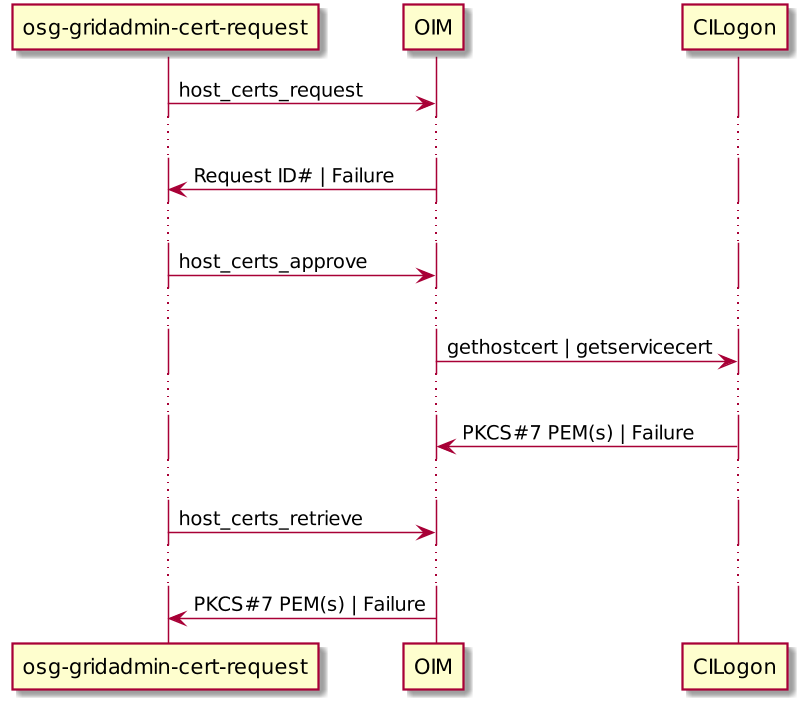
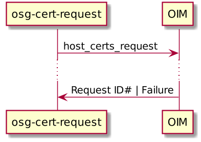
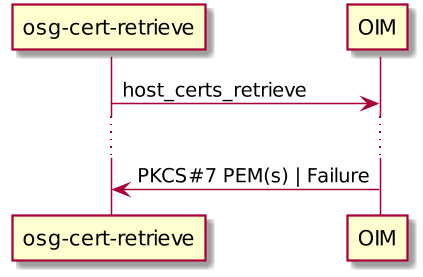

OSG PKI Overview
================

About this Doc
--------------

This document serves as a high-level overview of how users can interact with OIM and in turn, how OIM manages and forwards those interactions to OSG's CILogon CA.

Overview
--------

### Clients

OIM provides a [REST API](http://confluence.grid.iu.edu/display/CENTRAL/OIM+Rest+API+Guide) that users can interact with through the [web interface](http://oim.opensciencegrid.org), the [ITB web interface](http://oim-itb.grid.iu.edu), or the [OSG PKI tools](https://github.com/opensciencegrid/osg-pki-tools) (henceforth referred to as *clients*). Clients are responsible for sending properly formatted calls to the API and handling the responses.

If the client sends an improperly formatted call (i.e. a bug), OIM should return a failure response.

### OIM

OIM acts as the filter for incoming client calls: it verifies client calls (e.g. VO must be specified for host cert requests for domains that support multiple VOs ) and ensures sufficient authorization (e.g. Does the user have GridAdmin privileges for the requested domain to approve the certificate?). Certificate issuances or revocations are forwarded onto CILogon while all other calls are used to manage certificates within OIM.

### osg-gridadmin-cert-request

`osg-gridadmin-cert-request` serves as the Grid Admin's tool of choice for acquiring host certificates: it requests, approves, and retrieves certificates with a single command. Grid Admins are able to request certificates for single hosts or a series of hosts, up to 50 at a time.

The command-line tool performs its own argument verification, obtains the user's SSL credentials, and ensures that the user is below quota for the request they are making. After input is verified `osg-gridadmin-cert-request` generates CSRs for each host and submits them to OIM.

If the requesting user is authenticated as a Grid Admin for the requested domain and VO (which must be specified on the command-line if multiple VOs can issue certs for the requested domain), OIM approves the request and sends the `Request ID#` back to `osg-gridadmin-cert-request`.

Upon successful request, `osg-gridadmin-cert-request` sends an approval of the certificate to OIM, which is authenticatd and authorized as before, and OIM turns around and sends a request to CILogon. CILogon issues the certificate(s), sending it back to OIM, and OIM tells `osg-gridadmin-cert-request` that the certificate has been issued successfully.

At this point, `osg-gridadmin-cert-request` sends a retrieval request and OIM sends the certificate(s) back to the client.

### osg-cert-request

`osg-cert-request` is a tool for non-Grid Admin users to request host certificates, one at a time. The user can provide their own CSR or a hostname, for which a CSR is generated and forwarded to OIM with the rest of the request. OIM responds with the `Request ID#`, creates a ticket, and sends e-mails to the user and the Grid Admins of the requested domain + VO.

### osg-cert-retrieve

`osg-cert-retrieve` is used to retrieve host certificates associated with a specific `Request ID#` that have been issued (i.e. approved certificate request) by a Grid Admin. OIM responds to the retrieval request with the certificate(s) of the specified `Request ID#`.

### osg-cert-revoke

`osg-cert-revoke` is a tool for Grid Admins to revoke user or host certificates. With either a `Request ID#` or certificate serial number, the tool obtains the user's SSL credentials and sends the revocation request to OIM. OIM authenticates the user's request and if authorized, sends a revocation request to CILogon. If CILogon has successfully received the request, a successful response is forwarded to OIM, which is then forwarded back to the client tool. Revocation requests themselves are handled manually by CILogon CA administrators within one business day.

### osg-user-cert-renew

`osg-user-cert-renew` is used to expiring certificates. The user provides either the certificate serial number or `Request ID#` and the password that's used to encrypt their new private key. The tool combines those inputs with the user's SSL credentials to generate the renewal request that is sent to OIM, which is forwarded onto CILogon as a user cert request. If successful, OIM responds with the `Request ID#` and `osg-user-cert-renew` sends a retrieval request to OIM. If the retrieval request succeeds, OIM responds with requested certificate.

### osg-user-cert-revoke

`osg-user-cert-revoke` is a simple wrapper that calls `osg-cert-revoke --user`.

Resources
---------

-   [OIM REST API](http://confluence.grid.iu.edu/display/CENTRAL/OIM+Rest+API+Guide)
-   [CILogon OSG CA Design Doc](https://docs.google.com/document/d/1wGyV_P-oH3A26YvCtVwVYjW1suovjighCz6XN5VidJM/edit#)

